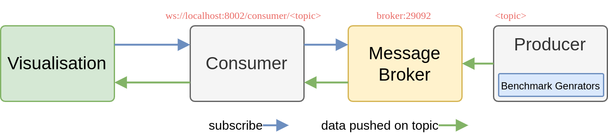

# About

Streaming data visualization and benchmarks. This is developed as part of initial protoype and evaluation of SKA's data visualization system. The production version of the code is at the SKA project repository: 

1. https://gitlab.com/ska-telescope/sdp/ska-sdp-qa-metric-generator
2. https://gitlab.com/ska-telescope/sdp/ska-sdp-qa-data-api
3. https://gitlab.com/ska-telescope/sdp/ska-sdp-qa-display


# Getting Started

## Start the services

Start all the services

```bash
docker-compose up -d

# Stopping producer        ... done
# Stopping visualisation   ... done
# Stopping consumer        ... done
# Stopping ksqldb-cli      ... done
# Stopping control-center  ... done
# Stopping ksqldb-server   ... done
# Stopping connect         ... done
# Stopping rest-proxy      ... done
# Stopping schema-registry ... done
# Stopping broker          ... done
# Stopping zookeeper       ... done
```

Check the status of the services

```bash
docker-compose ps

#      Name                    Command               State                                         Ports
# ---------------------------------------------------------------------------------------------------------------------------------------------
# broker            /etc/confluent/docker/run        Up      0.0.0.0:9092->9092/tcp,:::9092->9092/tcp, 0.0.0.0:9101->9101/tcp,:::9101->9101/tcp
# connect           /etc/confluent/docker/run        Up      0.0.0.0:8083->8083/tcp,:::8083->8083/tcp, 9092/tcp
# consumer          uvicorn server.main:app -- ...   Up      0.0.0.0:8002->8002/tcp,:::8002->8002/tcp
# control-center    /etc/confluent/docker/run        Up      0.0.0.0:9021->9021/tcp,:::9021->9021/tcp
# ksqldb-cli        /bin/sh                          Up
# ksqldb-server     /etc/confluent/docker/run        Up      0.0.0.0:8088->8088/tcp,:::8088->8088/tcp
# producer          uvicorn server.main:app -- ...   Up
# rest-proxy        /etc/confluent/docker/run        Up      0.0.0.0:8082->8082/tcp,:::8082->8082/tcp
# schema-registry   /etc/confluent/docker/run        Up      0.0.0.0:8081->8081/tcp,:::8081->8081/tcp
# visualisation     docker-entrypoint.sh yarn dev    Up      0.0.0.0:3000->3000/tcp,:::3000->3000/tcp
# zookeeper         /etc/confluent/docker/run        Up      0.0.0.0:2181->2181/tcp,:::2181->2181/tcp, 2888/tcp, 3888/tcp
```

Command to rebuild the images

```bash
docker-compose up -d --no-deps --build
```

## Produce Data and Visualise

Please see the `visualisation/README` and `producer/README`.

# Code Architecture



# References

Cite

```
@ARTICLE{10044667,
  author={Khan, Saiful and Rydow, Erik and Etemaditajbakhsh, Shahriar and Adamek, Karel and Armour, Wes},
  journal={IEEE Access}, 
  title={Web Performance Evaluation of High Volume Streaming Data Visualization}, 
  year={2023},
  volume={11},
  number={},
  pages={15623-15636},
  doi={10.1109/ACCESS.2023.3245043}}
```


