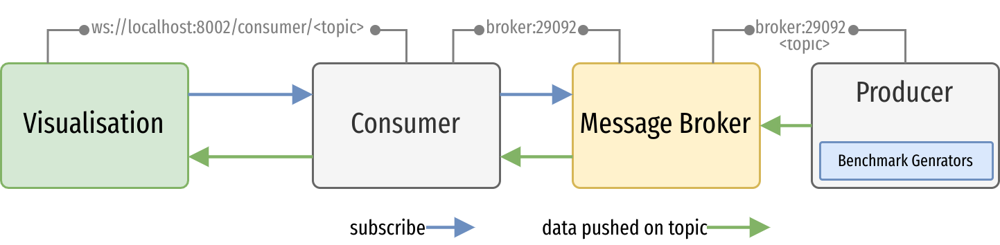

# Scalable Streaming Data VIS and Benchmarks

Start all the services

```bash
docker-compose up -d

# other useful docker commands
docker-compose ps
docker-compose up -d --no-deps --build
```

Open `localhost:3000` to access the UI and attach to the `producer` container to generate experimental data for the visualisations. For more information check the READMEs inside each folder.

## Code Architecture


